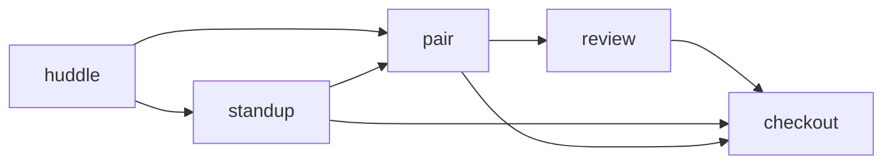

# DevCadence

An AI collaboration protocol for sessions that never start cold.

Every `/devcadence standup`, `pair`, `review`, or `checkout` is context-aware,
repeatable, and tracked. The agent knows what you worked on last time, which
project you're in, and how you like to work — including your preferred persona.



Huddle is standalone (ideate anytime). The rest form a chain — each mode reads
the previous session's log so nothing gets lost.

## Modes at a glance

| Mode | What it does |
|------|-------------|
| **standup** | Plan today in 30 seconds. Creates tickets, scans global logs for context you'd forgotten. |
| **pair** | Deep work with caveman compression (~55% fewer tokens). Agent answers, reviews, refactors — terse. |
| **review** | Check code against ticket AC. Approve or request changes. Auto-updates progress. |
| **checkout** | Wrap up session. Write log, update progress, estimate remaining. Save state for next time. |
| **huddle** | Free-form ideation with wizard + persona mapping. Global flag makes ideas surface in every future session. |
| **/devcadence mode <role>** | Switch the agent's brain: `/devcadence mode pm` makes it think like a PM. Stackable with caveman. |

## What makes DevCadence different

**Caveman mode** — token compression for pair/review. Fragments instead of
sentences. Same information, ~55% less tokens. Available in lite, full, ultra,
and wenyan variants.

**Global huddle logs** — tag a huddle as `global: true` and its ideas get
scanned on every mode start. No more "I had an idea last week and forgot."

**Behavioral observations** — the agent tracks your patterns across sessions
(priority: conciseness, asks about tests, likes async first). Observations
stack and influence how the agent communicates.

**Persona roles** — 5 built-in personas (dev-lead, pm, backend, frontend,
devops) that change system prompts. Switch with `/devcadence mode backend`.
Each role brings different priorities: PM focuses on user stories, backend
hits DB schemas and data flow.

**Instant repo SME** — `/devcadence new-sme` generates a repo expert memo in
~1000 tokens. Quick mode uses rg+tree, full mode adds repomix + graphify.

## Quick start

```bash
# Install the skill
npx skills add devcadence

# Or copy to project
cp -r skills/devcadence/ .opencode/skills/devcadence/

# Start a session
/devcadence standup
```

First run auto-detects your project and asks for log location, ticket format,
and workflow preferences. After that, `/devcadence standup` just works.

## For project leads

Each project needs a config block in `.opencode/commands/devcadence.md`:

```markdown
# .opencode/commands/devcadence.md
skill({ name: "devcadence" })

# Project Config
# - Log dir: ~/docs/my-project/
# - Progress: ~/docs/my-project/progress.json
# - Ticket format: MYPRJ-01
# - Modes: standup → pair → checkout (skip review)
```

The setup wizard walks through this on first run. No manual editing needed.

**Extending with specialist commands** — keep `devcadence.md` pure; create
sibling commands that load domain SMEs:

```
.opencode/commands/
├── devcadence.md
├── hortus-migration.md    # skill({ name: "devcadence" }) + skill({ name: "hc-migrate" })
└── next-migration.md      # skill({ name: "devcadence" }) + skill({ name: "next-migrate" })
```

All commands share the same project config.

## For contributors

```bash
git clone https://github.com/amLiux/devcadence.git
pip install -e ".[dev]"
pytest tests/
```

```
devcadence/
├── skills/devcadence/SKILL.md   # Protocol definition (single source of truth)
├── commands/devcadence.md       # Base invocation command
├── tests/                       # Schema validation
├── examples/                    # Example usage for different projects
├── install.sh                   # One-liner for any agent
├── LICENSE                      # MIT
└── README.md
```

## License

MIT
